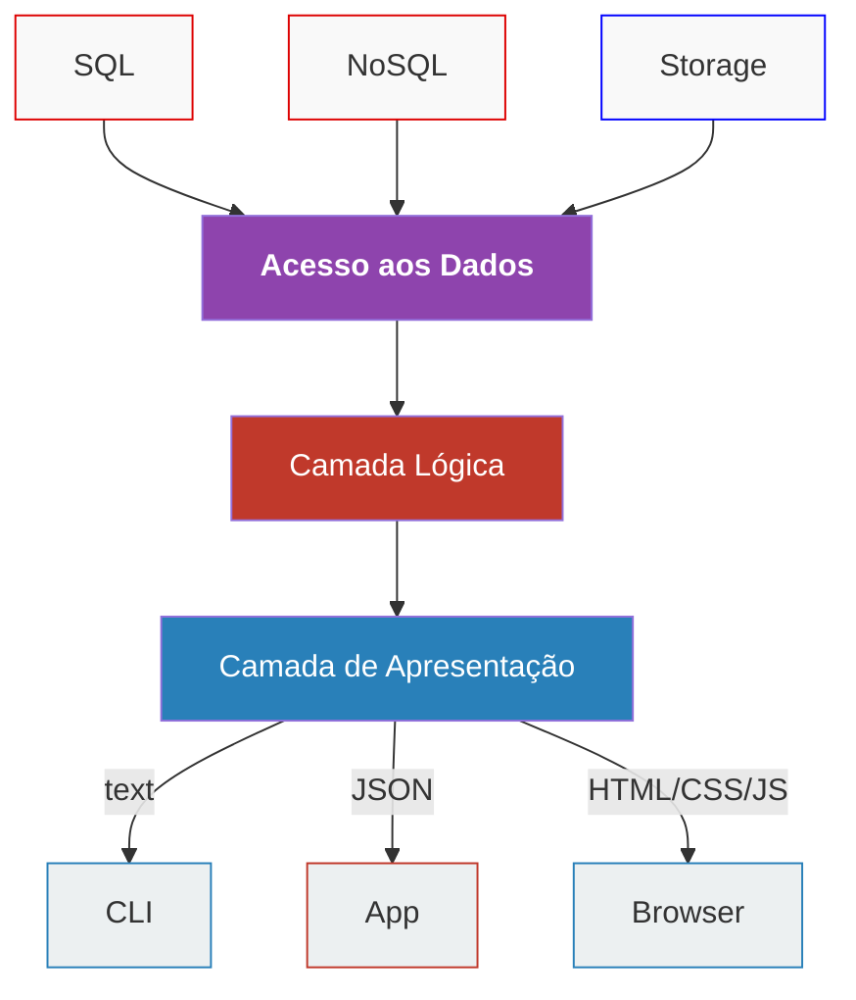

# Arquitetura do Sistema Simão Refrigeração

## Visão Geral

O sistema Simão Refrigeração segue uma arquitetura em camadas independentes, permitindo a separação clara de responsabilidades e facilitando a manutenção e evolução do sistema.



## Camadas da Arquitetura

### 1. Camada de Acesso aos Dados (Data Access Layer)

Localizada em `src/DataAccess/`, esta camada é responsável por:
- Abstrair o acesso a diferentes fontes de dados (SQL, NoSQL, armazenamento de arquivos)
- Implementar o padrão Repository para cada entidade
- Gerenciar conexões com bancos de dados
- Realizar operações CRUD básicas

**Componentes principais:**
- Interfaces de repositório (`RepositoryInterface`)
- Implementações de repositório (`ClienteRepository`, `AgendamentoRepository`, etc.)
- Abstrações de banco de dados (`DatabaseInterface`, `MySQLDatabase`)
- Gerenciadores de armazenamento de arquivos

### 2. Camada Lógica de Negócio (Business Logic Layer)

Localizada em `src/BusinessLogic/`, esta camada contém:
- Entidades de domínio que representam os conceitos do negócio
- Serviços que implementam regras de negócio
- Validações e lógica de processamento
- Casos de uso da aplicação

**Componentes principais:**
- Entidades (`Cliente`, `Agendamento`, `Servico`, etc.)
- Serviços de negócio (`ClienteService`, `AgendamentoService`, etc.)
- Validadores e processadores

### 3. Camada de Apresentação (Presentation Layer)

Localizada em `src/Presentation/` e `public/`, esta camada é responsável por:
- Interfaces com o usuário (Web, API, CLI)
- Controladores que recebem requisições e retornam respostas
- Templates e visualizações
- Formatação de dados para exibição

**Componentes principais:**
- Controladores Web (`ClienteWebController`)
- Controladores API (`ClienteController`)
- Templates e views (`views/`)
- Interfaces de linha de comando

## Estrutura de Diretórios

A estrutura de diretórios foi organizada para refletir a arquitetura em camadas:

```
simaorefrigeracao/
├── public/                   # Arquivos acessíveis via web
│   ├── admin/                # Interface administrativa
│   ├── api/                  # Endpoints da API REST
│   ├── assets/               # Recursos estáticos (CSS, JS, imagens)
│   ├── tecnico/              # Interface para técnicos
│   └── index.php             # Ponto de entrada principal
├── src/                      # Código fonte principal
│   ├── DataAccess/           # Camada de Acesso aos Dados
│   │   ├── Database/         # Abstrações de banco de dados
│   │   ├── Repositories/     # Repositórios de dados
│   │   └── Storage/          # Gerenciamento de arquivos
│   ├── BusinessLogic/        # Camada Lógica de Negócio
│   │   ├── Entities/         # Entidades de domínio
│   │   ├── Services/         # Serviços de negócio
│   │   └── UseCases/         # Casos de uso
│   └── Presentation/         # Camada de Apresentação
│       ├── API/              # Controladores da API
│       ├── CLI/              # Interface de linha de comando
│       └── Web/              # Controladores Web
├── config/                   # Configurações do sistema
├── controllers/              # Controladores legados (para compatibilidade)
├── views/                    # Templates e visualizações
└── bootstrap.php             # Inicialização do sistema
```

## Princípios Arquiteturais

### Independência de Tecnologia

Cada camada é independente das tecnologias utilizadas nas outras camadas. Por exemplo:
- A camada de lógica de negócio não depende de como os dados são armazenados
- A camada de apresentação não depende de como a lógica de negócio é implementada
- É possível trocar o banco de dados sem afetar a lógica de negócio ou a apresentação

### Inversão de Dependência

As camadas superiores não dependem de implementações concretas das camadas inferiores, mas sim de abstrações:
- Interfaces definem contratos entre camadas
- Injeção de dependência é utilizada para fornecer implementações concretas
- Um container de dependências centralizado gerencia as instâncias e suas dependências

### Separação de Responsabilidades

Cada camada tem uma responsabilidade bem definida:
- Acesso aos Dados: Como os dados são armazenados e recuperados
- Lógica de Negócio: Regras e processamento de dados
- Apresentação: Como os dados são apresentados ao usuário

## Fluxo de Execução

1. Uma requisição chega ao sistema através de um dos pontos de entrada (Web, API, CLI)
2. O controlador apropriado na camada de apresentação recebe a requisição
3. O controlador chama os serviços necessários na camada de lógica de negócio
4. Os serviços aplicam regras de negócio e chamam repositórios na camada de acesso aos dados
5. Os repositórios interagem com as fontes de dados e retornam os resultados
6. Os dados fluem de volta através das camadas, sendo processados em cada uma
7. O controlador formata a resposta e a envia de volta ao cliente

## Benefícios da Arquitetura

1. **Manutenibilidade**: Mudanças em uma camada não afetam as outras
2. **Testabilidade**: Cada camada pode ser testada isoladamente
3. **Escalabilidade**: Componentes podem ser escalados independentemente
4. **Flexibilidade**: Fácil adaptação a novos requisitos ou tecnologias
5. **Reutilização**: Lógica de negócio pode ser compartilhada entre diferentes interfaces