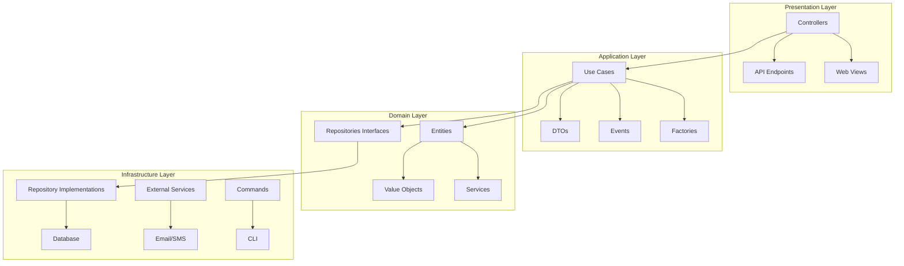
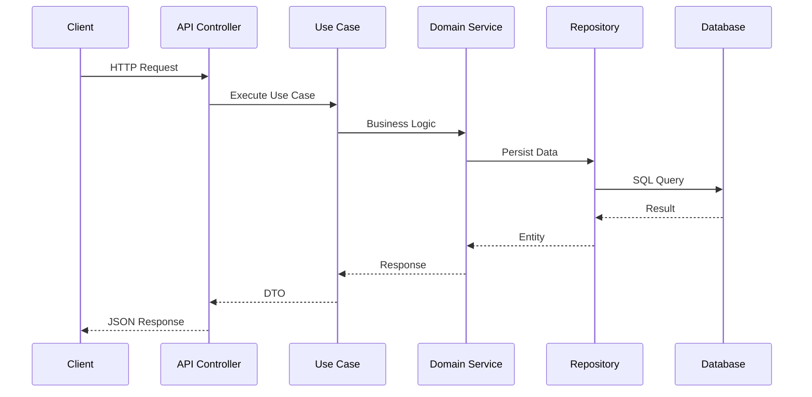
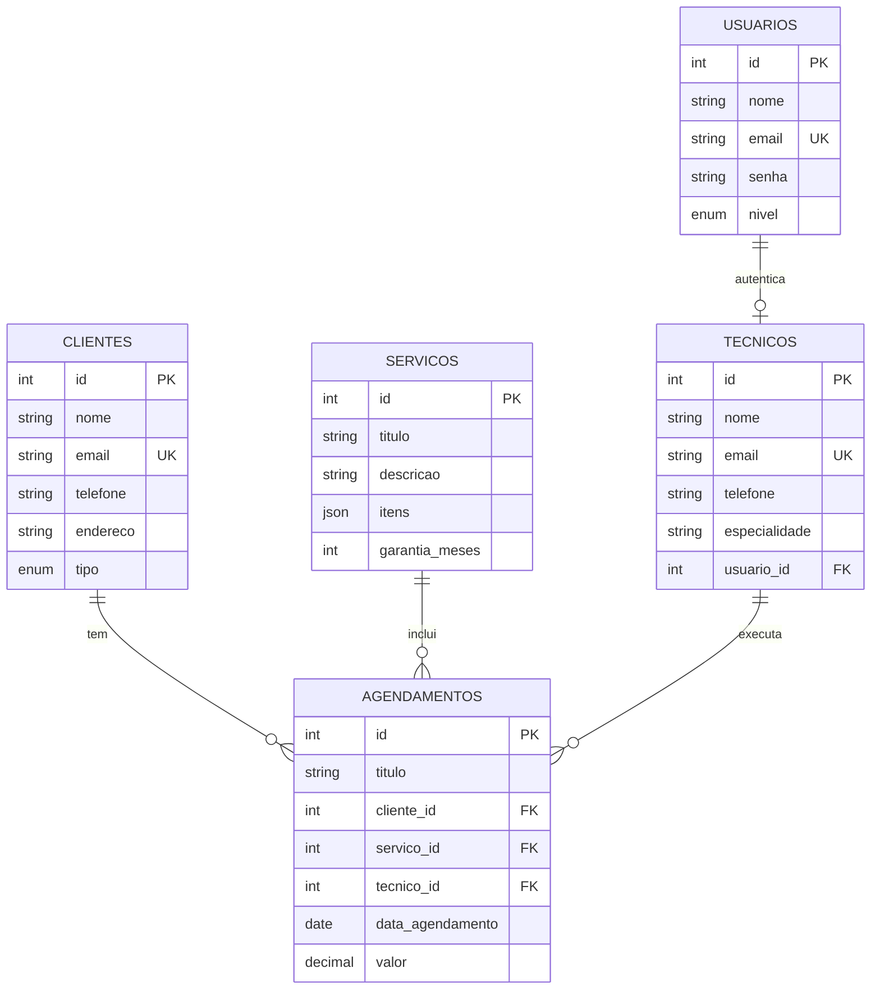
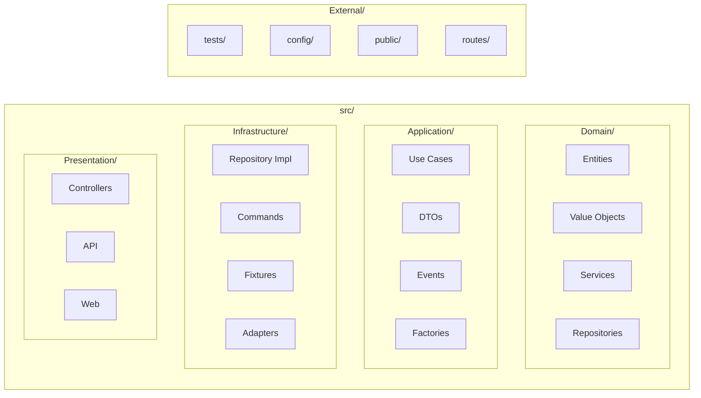
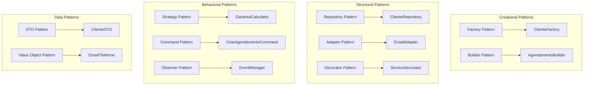

# Sistema Simão Refrigeração

Sistema de gestão moderno com arquitetura em camadas, aplicando Design Patterns e princípios SOLID.

## 🚀 Guia de Inicialização Completo

### 1. Configuração Inicial
```bash
# Clone o repositório
git clone <repo-url>
cd simaorefrigeracao

# Configurar ambiente
make setup
make install
```

### 2. Configurar Banco de Dados
```bash
# Editar .env com suas credenciais MySQL
DB_HOST=localhost
DB_NAME=simaorefrigeracao
DB_USER=root
DB_PASS=sua_senha

# Criar banco e tabelas
make db-create

# Popular com dados de teste
make db-fixtures
```

### 3. Iniciar Servidor
```bash
# Servidor de desenvolvimento
make serve

# Acesse: http://localhost:8000
```

### 4. Credenciais de Teste

#### 👨‍💼 Administrador
- **Email**: admin@simao.com
- **Senha**: admin123
- **Acesso**: Painel completo

#### 🔧 Técnicos
- **Carlos Silva**: carlos.silva@simao.com / tecnico123
- **Marcos Oliveira**: marcos.oliveira@simao.com / tecnico123  
- **Pedro Santos**: pedro.santos@simao.com / tecnico123 (Técnico Admin)

### 5. Acessar Banco de Dados
```bash
# Via MySQL CLI
mysql -u root -p simaorefrigeracao

# Via phpMyAdmin
http://localhost/phpmyadmin

# Verificar dados
SELECT * FROM usuarios;
SELECT * FROM clientes;
SELECT * FROM tecnicos;
SELECT * FROM servicos;
```

### ✅ Checklist de Funcionamento

- [ ] Servidor rodando em localhost:8000
- [ ] Login admin funcionando
- [ ] Login técnico funcionando
- [ ] API retornando dados
- [ ] Banco populado com fixtures
- [ ] Testes passando

## 📋 Comandos Disponíveis

```bash
make help              # Lista todos os comandos
make install           # Instala dependências
make install-dev       # Instala dependências de desenvolvimento
make setup             # Configuração inicial do projeto

# Banco de dados
make db-create         # Cria o banco de dados
make db-update         # Atualiza schema do banco
make db-validate       # Valida schema do banco
make db-fixtures       # Carrega dados fictícios
make db-reset          # Reseta banco completo
make fixtures-load     # Carrega fixtures usando arquivos PHP

# Servidor
make serve             # Servidor (localhost:8000)
make serve-api         # Inicia servidor apenas para API

# Testes
make test              # Executa testes
make test-unit         # Executa testes unitários
make test-integration  # Executa testes de integração
make test-coverage     # Executa testes com coverage

# Qualidade de código
make cs-fix            # Corrige estilo de código
make cs-check          # Verifica estilo de código
make phpstan           # Análise estática
make quality           # Executa todas verificações de qualidade
make check-syntax      # Verifica sintaxe PHP

# Cache e limpeza
make cache-clear       # Limpa cache
make logs-clear        # Limpa logs
make clean             # Limpa cache e logs
make clean-legacy      # Remove arquivos legados

# Docker
make docker-up         # Sobe containers Docker
make docker-down       # Para containers Docker
make docker-build      # Constrói imagens Docker

# Migrations
make migration-generate # Gera nova migration
make migration-migrate  # Executa migrations
make migration-status   # Status das migrations

# Deploy
make prod-deploy       # Deploy para produção
make autoload          # Regenera autoload
```

## 🏗️ Arquitetura

### Diagrama de Arquitetura



### Fluxo de Dados



### Domain-Driven Design (DDD)

#### Domain Layer
- **Entities**: Objetos de negócio com identidade
- **Value Objects**: Objetos imutáveis sem identidade (Email, Telefone)
- **Repositories**: Interfaces para persistência
- **Services**: Lógica de domínio complexa
- **Exceptions**: Exceções específicas do domínio

#### Application Layer
- **Services**: Orquestração de casos de uso
- **DTOs**: Objetos de transferência de dados
- **Events**: Eventos de aplicação
- **Factories**: Criação de objetos complexos

#### Infrastructure Layer
- **Repositories**: Implementações concretas
- **Factories**: Criação de recursos externos
- **Commands**: Comandos CLI
- **Fixtures**: Dados de teste

#### Presentation Layer
- **Controllers**: Pontos de entrada HTTP
- **Views**: Templates de apresentação

### Design Patterns
- **Repository Pattern**: Abstração de persistência
- **Factory Pattern**: Criação de objetos
- **Value Object Pattern**: Email, Telefone com validação
- **Observer Pattern**: Sistema de eventos
- **DTO Pattern**: Transferência de dados

### Princípios SOLID
- **S**: Responsabilidade única por classe
- **O**: Extensível via interfaces
- **L**: Substituição de implementações
- **I**: Interfaces específicas
- **D**: Inversão de dependências

## 🛠️ Tecnologias

- **PHP 8.1+** com tipagem forte
- **Doctrine ORM** para persistência
- **Symfony Components** (DI, Routing, Validator)
- **PHPUnit** para testes
- **PHP-CS-Fixer** para padronização
- **PHPStan** para análise estática

## 📊 API REST

### Clientes
```bash
GET    /api/clientes          # Listar
POST   /api/clientes          # Criar
GET    /api/clientes/{id}     # Buscar
PUT    /api/clientes/{id}     # Atualizar
DELETE /api/clientes/{id}     # Excluir
GET    /api/clientes/search   # Filtrar
```

### Agendamentos
```bash
GET    /api/agendamentos                    # Listar
POST   /api/agendamentos                    # Criar
GET    /api/agendamentos/{id}               # Buscar
PUT    /api/agendamentos/{id}               # Atualizar
DELETE /api/agendamentos/{id}               # Excluir
GET    /api/agendamentos/cliente/{id}       # Por cliente
GET    /api/agendamentos/tecnico/{id}       # Por técnico
```

### Serviços
```bash
GET    /api/servicos          # Listar
POST   /api/servicos          # Criar
GET    /api/servicos/{id}     # Buscar
PUT    /api/servicos/{id}     # Atualizar
DELETE /api/servicos/{id}     # Excluir
```

### Técnicos
```bash
GET    /api/tecnicos          # Listar
POST   /api/tecnicos          # Criar
GET    /api/tecnicos/{id}     # Buscar
PUT    /api/tecnicos/{id}     # Atualizar
DELETE /api/tecnicos/{id}     # Excluir
GET    /api/tecnicos/ativos   # Apenas ativos
```

### Autenticação
```bash
POST   /api/auth/login        # Login
POST   /api/auth/logout       # Logout
GET    /api/auth/me           # Usuário atual
POST   /api/auth/refresh      # Renovar token
```

### Exemplo de Request
```json
{
  "nome": "João Silva",
  "email": "joao@email.com",
  "telefone": "11987654321",
  "endereco": "Rua das Flores, 123",
  "cidade": "São Paulo",
  "estado": "SP",
  "cep": "01234-567",
  "tipo": "residencial"
}
```

### Exemplo de Response
```json
{
  "success": true,
  "data": [
    {
      "id": 1,
      "nome": "João Silva",
      "email": "joao@email.com",
      "telefone": "11987654321",
      "tipo": "residencial"
    }
  ]
}
```

## 🗄️ Database Schema

### clientes
- `id` - Primary Key
- `nome` - Nome do cliente
- `email` - Email único
- `telefone` - Telefone formatado
- `endereco` - Endereço completo
- `cidade` - Cidade
- `estado` - Estado (2 chars)
- `cep` - CEP formatado
- `tipo` - ENUM(residencial, comercial, industrial)
- `observacoes` - Observações gerais
- `data_criacao` - Timestamp de criação
- `data_atualizacao` - Timestamp de atualização

### servicos
- `id` - Primary Key
- `titulo` - Nome do serviço
- `icone` - Ícone para interface
- `descricao` - Descrição detalhada
- `itens` - JSON com lista de itens
- `garantia_meses` - Período de garantia
- `data_criacao` - Timestamp de criação
- `data_atualizacao` - Timestamp de atualização

### tecnicos
- `id` - Primary Key
- `nome` - Nome do técnico
- `email` - Email único
- `telefone` - Telefone formatado
- `especialidade` - Área de especialização
- `cor` - Cor para calendário (hex)
- `status` - ENUM(ativo, inativo)
- `usuario_id` - FK para usuarios
- `data_criacao` - Timestamp de criação
- `data_atualizacao` - Timestamp de atualização

### agendamentos
- `id` - Primary Key
- `titulo` - Título do agendamento
- `cliente_id` - FK para clientes
- `servico_id` - FK para servicos
- `tecnico_id` - FK para tecnicos
- `data_agendamento` - Data do serviço
- `hora_inicio` - Hora de início
- `hora_fim` - Hora de término
- `observacoes` - Observações gerais
- `status` - ENUM(pendente, concluido, cancelado)
- `valor` - Valor do serviço
- `valor_pendente` - Valor pendente
- `data_garantia` - Data limite da garantia
- `observacoes_tecnicas` - Observações técnicas
- `local_servico` - Local específico do serviço
- `data_criacao` - Timestamp de criação
- `data_atualizacao` - Timestamp de atualização

### usuarios
- `id` - Primary Key
- `nome` - Nome do usuário
- `email` - Email único
- `senha` - Hash da senha
- `nivel` - ENUM(admin, editor, tecnico, tecnico_adm)
- `ultimo_login` - Timestamp do último login
- `data_criacao` - Timestamp de criação
- `data_atualizacao` - Timestamp de atualização

### Diagrama de Relacionamentos



## 📁 Estrutura

### Diagrama de Estrutura



### Organização de Pastas

```
├── src/
│   ├── Domain/           # Regras de negócio
│   ├── Application/      # Casos de uso
│   ├── Infrastructure/   # Implementações
│   └── Presentation/     # Controllers
├── tests/               # Testes automatizados
├── bin/                 # Scripts e comandos
├── config/              # Configurações
├── public/              # Ponto de entrada web
└── routes/              # Definições de rotas
```

## 🔧 Desenvolvimento

### Setup Inicial
```bash
make setup               # Cria .env
make install-dev         # Instala dependências
make db-create           # Cria banco
make db-fixtures         # Carrega dados teste
make serve               # Inicia servidor
```

### Qualidade de Código
```bash
make cs-fix              # Corrige estilo
make cs-check            # Verifica estilo
make phpstan             # Análise estática
make quality             # Todas verificações
```

### Testes
```bash
make test-unit           # Testes unitários
make test-integration    # Testes de integração
make test-coverage       # Cobertura de testes
```

### Banco de Dados
```bash
make db-reset            # Reseta banco
make db-fixtures         # Carrega dados teste
make migration-generate  # Gera migration
make migration-migrate   # Executa migrations
```

## 🐳 Docker

```bash
make docker-up           # Sobe ambiente
make docker-build        # Constrói imagens
make docker-down         # Para ambiente
```

## 🚀 Deploy

### Produção
```bash
make prod-deploy         # Deploy completo
```

### CI/CD
GitHub Actions configurado para:
- Verificação de estilo (PHP-CS-Fixer)
- Análise estática (PHPStan)
- Testes automatizados (PHPUnit)

## 🎯 Entidades e Design Patterns

### Entidades Principais
- **Cliente**: Dados pessoais com validação (Value Objects)
- **Agendamento**: Serviços agendados (Builder Pattern)
- **Serviço**: Tipos de serviços oferecidos (Decorator Pattern)
- **Técnico**: Profissionais especializados
- **Usuário**: Sistema de autenticação

### Diagrama de Design Patterns



### Design Patterns Implementados
- **Repository Pattern**: `src/Domain/Repository/`
- **Factory Pattern**: `src/Application/Factory/`
- **Value Object Pattern**: `src/Domain/ValueObject/`
- **Builder Pattern**: `src/Domain/Builder/`
- **Strategy Pattern**: `src/Domain/Strategy/`
- **Decorator Pattern**: `src/Domain/Decorator/`
- **Command Pattern**: `src/Domain/Command/`
- **Observer Pattern**: `src/Infrastructure/Observer/`
- **Adapter Pattern**: `src/Infrastructure/Adapter/`
- **DTO Pattern**: `src/Application/DTO/`

## ✅ Status do Projeto

- ✅ Arquitetura DDD implementada
- ✅ Design Patterns aplicados
- ✅ Princípios SOLID seguidos
- ✅ Testes unitários criados
- ✅ CI/CD configurado
- ✅ Documentação completa
- ✅ Qualidade de código garantida

## 📄 Licença

Este projeto está sob a licença MIT. Veja o arquivo [LICENSE](LICENSE) para detalhes.