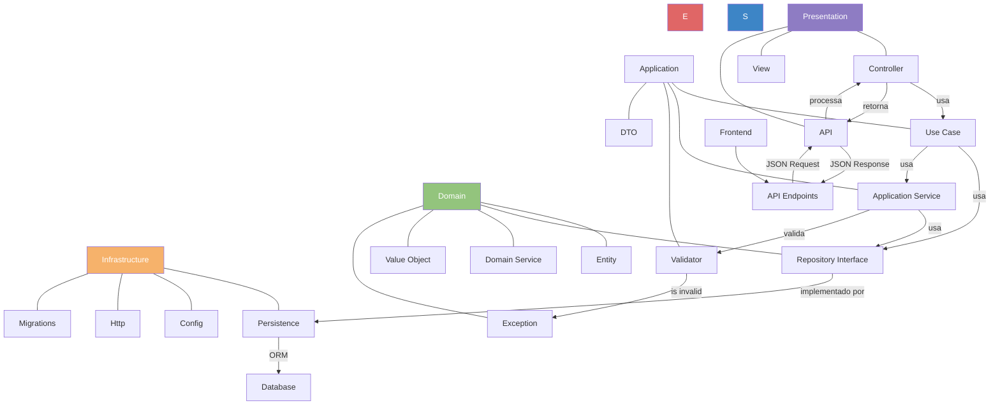

# Simão Refrigeração

Sistema de gerenciamento para empresa de refrigeração, utilizando Doctrine ORM para persistência de dados e programação orientada a objetos.

## Arquitetura do Sistema

## Requisitos

- Docker e Docker Compose

## Credenciais de Acesso

### Área Administrativa
- **URL**: http://localhost:8081/admin
- **Email**: admin@simaorefrigeracao.com
- **Senha**: password

### Área do Técnico
- **URL**: http://localhost:8081/tecnico
- **Email**: tecnico@simaorefrigeracao.com
- **Senha**: password

## Passo a Passo para Iniciar o Site

1. **Preparação do Ambiente**
   - Certifique-se que o Docker Desktop está instalado e em execução
   - Clone o repositório: `git clone [url-do-repositorio]`
   - Navegue até a pasta do projeto: `cd simaorefrigeracao`

2. **Construir os Containers**
   - Execute: `make build`
   - Este comando constrói as imagens Docker necessárias para o projeto
   - Aguarde até que todas as imagens sejam construídas

3. **Iniciar os Containers**
   - Execute: `make up`
   - Este comando inicia todos os containers (PHP, Nginx, MySQL)
   - Aguarde até que todos os serviços estejam disponíveis

4. **Instalar Dependências**
   - Execute: `make composer`
   - Este comando instala todas as dependências PHP via Composer
   - Aguarde a conclusão da instalação

5. **Configurar o Banco de Dados**
   - Execute: `make setup-db`
   - Este comando cria o banco de dados e as tabelas necessárias

6. **Alimentar o Banco de Dados**
   - Execute: `make seed-db`
   - Este comando insere dados iniciais no banco de dados, incluindo usuários de teste

7. **Acessar o Site**
   - Abra o navegador e acesse: `http://localhost:8081`
   - O sistema deve estar funcionando e pronto para uso
   - Use as credenciais acima para acessar as áreas restritas

8. **Para Parar os Containers**
   - Quando terminar de usar, execute: `make down`
   - Isso irá parar todos os containers

## Comandos úteis

- `make up` - Inicia os containers
- `make down` - Para os containers
- `make composer` - Executa composer install
- `make setup-db` - Configura o banco de dados
- `make seed-db` - Alimenta o banco de dados com dados iniciais
- `make shell` - Acessa o shell do container PHP
- `make restart` - Reinicia todos os containers

## Estrutura do Projeto

O projeto segue uma arquitetura limpa com as seguintes camadas:

- **Domain**: Contém as regras de negócio e entidades principais
  - Entity: Classes que representam as entidades do domínio
  - Repository: Interfaces para acesso a dados
  - Service: Serviços específicos do domínio
  - ValueObject: Objetos de valor imutáveis
  - Exception: Exceções específicas do domínio

- **Application**: Orquestra o fluxo de dados entre as camadas
  - UseCase: Implementa casos de uso da aplicação
  - Service: Serviços de aplicação
  - Validator: Validação de dados
  - DTO: Objetos de transferência de dados

- **Infrastructure**: Implementações técnicas e detalhes externos
  - Persistence: Implementações de repositórios
  - Http: Componentes HTTP
  - Config: Configurações do sistema
  - Migrations: Migrações do banco de dados

- **Presentation**: Interface com o usuário
  - Controller: Controladores que recebem requisições
  - View: Templates e componentes visuais
  - API: Endpoints da API REST

## Entidades

- **Cliente**: Representa os clientes da empresa
- **Servico**: Representa os serviços oferecidos
- **Tecnico**: Representa os técnicos da empresa
- **Agendamento**: Representa os agendamentos de serviços
- **Usuario**: Representa os usuários do sistema
- **Contato**: Representa os contatos recebidos pelo site