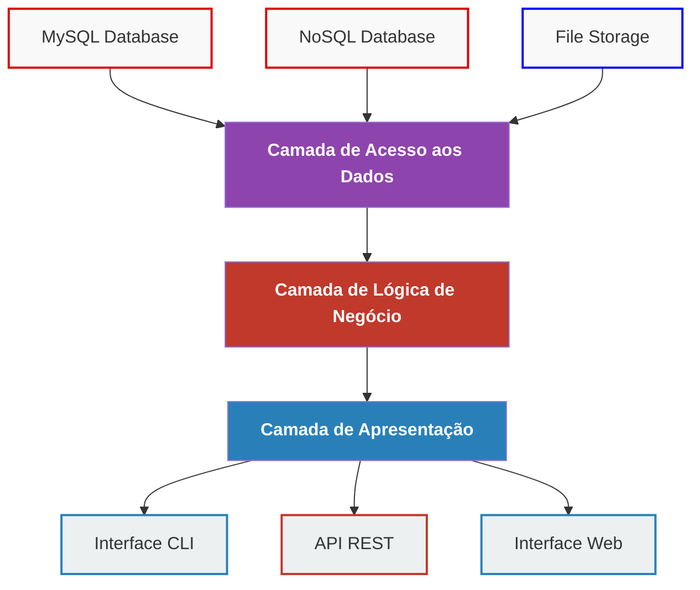

# Sistema Simão Refrigeração

Sistema de gestão para empresa de refrigeração com arquitetura em camadas independentes.

## Arquitetura



## Estrutura do Projeto

```
src/
├── DataAccess/              # Camada de Acesso aos Dados
│   ├── Database/           # Interfaces e implementações de BD
│   ├── Storage/            # Armazenamento de arquivos
│   └── Repositories/       # Repositórios de dados
├── BusinessLogic/          # Camada de Lógica de Negócio
│   ├── Entities/          # Entidades de domínio
│   ├── Services/          # Serviços de negócio
│   └── UseCases/          # Casos de uso
└── Presentation/           # Camada de Apresentação
    ├── API/               # Controllers da API REST
    ├── Web/               # Controllers Web
    └── CLI/               # Interface de linha de comando
```

## Princípios da Arquitetura

### 1. Independência de Tecnologia
- Cada camada é independente de tecnologia específica
- Interfaces definem contratos entre camadas
- Fácil substituição de implementações

### 2. Separação de Responsabilidades
- **Acesso aos Dados**: Persistência e recuperação
- **Lógica de Negócio**: Regras e validações
- **Apresentação**: Interface com usuário

### 3. Inversão de Dependência
- Camadas superiores não dependem de implementações
- Uso de interfaces e injeção de dependência
- Container de dependências centralizado

## Tecnologias Atuais

- **Backend**: PHP 8+
- **Frontend**: Next.js + React
- **Banco**: MySQL
- **Estilo**: Tailwind CSS

## Como Usar

### Instalação
```bash
composer install
npm install
```

### Configuração
```bash
cp .env.example .env
# Configure as variáveis de ambiente
```

### Execução
```bash
# Desenvolvimento
npm run dev
php -S localhost:8000
```

## Exemplos de Uso

### API REST
```bash
GET /api/clientes          # Listar clientes
POST /api/clientes         # Criar cliente
PUT /api/clientes/{id}     # Atualizar cliente
DELETE /api/clientes/{id}  # Excluir cliente
```

### Interface Web
```
/clientes                  # Lista de clientes
/clientes/create           # Formulário de criação
/clientes/{id}/edit        # Formulário de edição
```

## Vantagens da Arquitetura

1. **Flexibilidade**: Troca fácil de tecnologias
2. **Testabilidade**: Cada camada pode ser testada isoladamente
3. **Manutenibilidade**: Código organizado e limpo
4. **Escalabilidade**: Fácil adição de novas funcionalidades
5. **Reutilização**: Lógica de negócio compartilhada entre interfaces