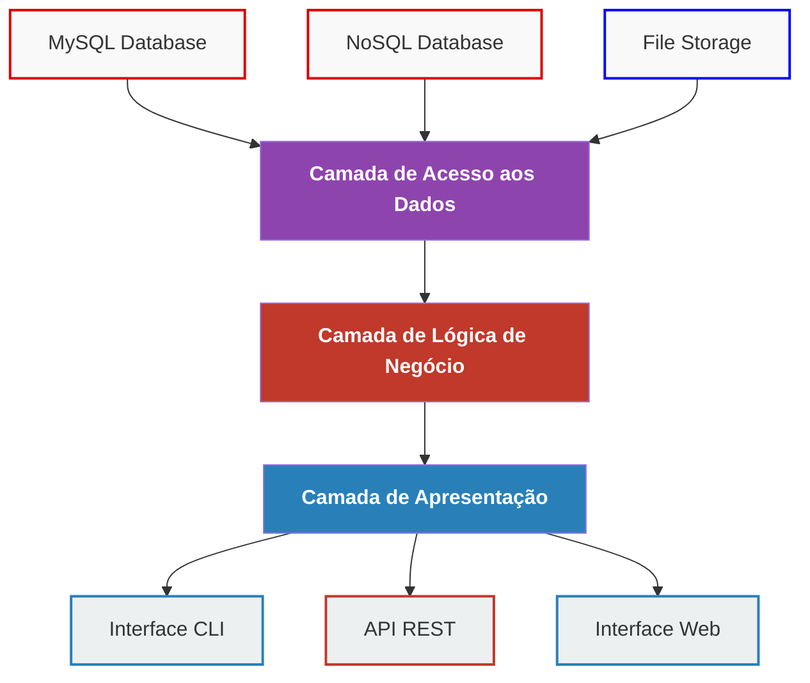

# Sistema Simão Refrigeração

Sistema de gestão para empresa de refrigeração com arquitetura em camadas independentes.

## Arquitetura



## Nova Estrutura do Projeto

```
simaorefrigeracao/
├── app/                      # Aplicação Next.js/React
│   ├── admin/                # Páginas de administração React
│   ├── globals.css           # Estilos globais
│   ├── layout.tsx            # Layout principal
│   └── page.tsx              # Página inicial
├── bin/                      # Binários e executáveis
├── components/               # Componentes React reutilizáveis
│   └── ui/                   # Componentes de UI
├── config/                   # Configurações do sistema
│   ├── config.php            # Configurações gerais
│   └── database.php          # Configuração do banco de dados
├── controllers/              # Controladores PHP
│   ├── Admin/                # Controladores administrativos
│   └── ...                   # Outros controladores
├── docker/                   # Configurações Docker
├── helpers/                  # Funções auxiliares
├── hooks/                    # React hooks
├── lib/                      # Bibliotecas e utilitários
├── public/                   # Arquivos públicos acessíveis via web
│   ├── admin/                # Páginas administrativas PHP
│   ├── api/                  # Endpoints da API
│   ├── assets/               # Recursos estáticos (CSS, JS, imagens)
│   ├── tecnico/              # Páginas do técnico
│   └── index.php             # Ponto de entrada principal
├── scripts/                  # Scripts de utilidade e manutenção
├── src/                      # Código fonte principal
│   ├── Application/          # Camada de aplicação
│   ├── Domain/               # Camada de domínio
│   ├── Infrastructure/       # Camada de infraestrutura
│   └── Presentation/         # Camada de apresentação
├── styles/                   # Estilos globais
├── vendor/                   # Dependências Composer (gerado automaticamente)
├── views/                    # Templates e visualizações
│   ├── admin/                # Views administrativas
│   ├── public/               # Views públicas
│   └── tecnico/              # Views do técnico
├── .dockerignore             # Arquivos ignorados pelo Docker
├── .env.example              # Exemplo de variáveis de ambiente
├── .gitignore                # Arquivos ignorados pelo Git
├── .htaccess                 # Configurações do Apache
├── bootstrap.php             # Inicialização do sistema
├── composer.json             # Dependências PHP
├── docker-compose.yml        # Configuração do Docker Compose
├── index.php                 # Ponto de entrada principal
├── next.config.mjs           # Configuração do Next.js
├── package.json              # Dependências JavaScript
├── tailwind.config.ts        # Configuração do Tailwind CSS
└── tsconfig.json             # Configuração do TypeScript
```

## Princípios da Arquitetura

### 1. Independência de Tecnologia
- Cada camada é independente de tecnologia específica
- Interfaces definem contratos entre camadas
- Fácil substituição de implementações

### 2. Separação de Responsabilidades
- **Acesso aos Dados**: Persistência e recuperação
- **Lógica de Negócio**: Regras e validações
- **Apresentação**: Interface com usuário

### 3. Inversão de Dependência
- Camadas superiores não dependem de implementações
- Uso de interfaces e injeção de dependência
- Container de dependências centralizado

## Tecnologias Atuais

- **Backend**: PHP 8+
- **Frontend**: Next.js + React
- **Banco**: MySQL
- **Estilo**: Tailwind CSS

## Como Usar

### Instalação
```bash
composer install
npm install
```

### Configuração
```bash
cp .env.example .env
# Configure as variáveis de ambiente
```

### Execução
```bash
# Desenvolvimento
npm run dev
php -S localhost:8000 -t public
```

### Reorganização de Arquivos
Para organizar os arquivos da raiz para a nova estrutura:
```bash
php reorganize_structure.php
```

## Exemplos de Uso

### API REST
```bash
GET /api/clientes          # Listar clientes
POST /api/clientes         # Criar cliente
PUT /api/clientes/{id}     # Atualizar cliente
DELETE /api/clientes/{id}  # Excluir cliente
```

### Interface Web
```
/admin/dashboard           # Dashboard administrativo
/tecnico/agendamentos      # Agendamentos do técnico
```

## Vantagens da Arquitetura

1. **Flexibilidade**: Troca fácil de tecnologias
2. **Testabilidade**: Cada camada pode ser testada isoladamente
3. **Manutenibilidade**: Código organizado e limpo
4. **Escalabilidade**: Fácil adição de novas funcionalidades
5. **Reutilização**: Lógica de negócio compartilhada entre interfaces